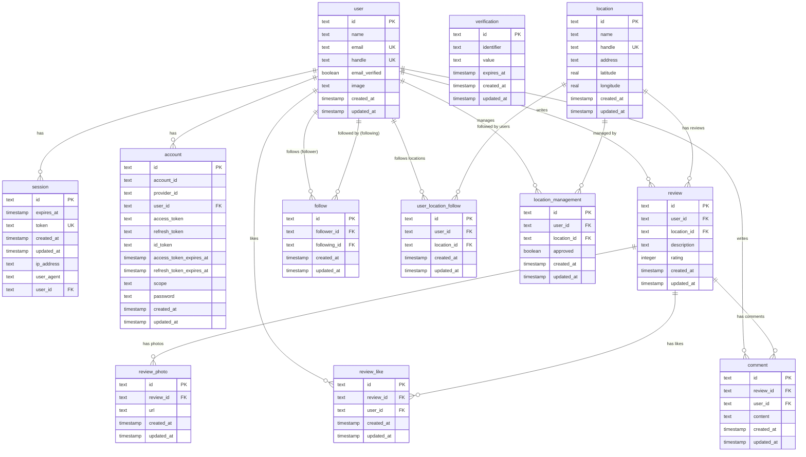

# Database Schema

```mermaid
erDiagram
    user {
        text id PK
        text name
        text email UK
        text handle UK
        boolean email_verified
        text image
        timestamp created_at
        timestamp updated_at
    }

    session {
        text id PK
        timestamp expires_at
        text token UK
        timestamp created_at
        timestamp updated_at
        text ip_address
        text user_agent
        text user_id FK
    }

    account {
        text id PK
        text account_id
        text provider_id
        text user_id FK
        text access_token
        text refresh_token
        text id_token
        timestamp access_token_expires_at
        timestamp refresh_token_expires_at
        text scope
        text password
        timestamp created_at
        timestamp updated_at
    }

    verification {
        text id PK
        text identifier
        text value
        timestamp expires_at
        timestamp created_at
        timestamp updated_at
    }

    location {
        text id PK
        text name
        text handle UK
        text address
        real latitude
        real longitude
        timestamp created_at
        timestamp updated_at
    }

    review {
        text id PK
        text user_id FK
        text location_id FK
        text description
        integer rating
        timestamp created_at
        timestamp updated_at
    }

    review_photo {
        text id PK
        text review_id FK
        text url
        timestamp created_at
        timestamp updated_at
    }

    review_like {
        text id PK
        text review_id FK
        text user_id FK
        timestamp created_at
        timestamp updated_at
    }

    comment {
        text id PK
        text review_id FK
        text user_id FK
        text content
        timestamp created_at
        timestamp updated_at
    }

    follow {
        text id PK
        text follower_id FK
        text following_id FK
        timestamp created_at
        timestamp updated_at
    }

    user_location_follow {
        text id PK
        text user_id FK
        text location_id FK
        timestamp created_at
        timestamp updated_at
    }

    location_management {
        text id PK
        text user_id FK
        text location_id FK
        boolean approved
        timestamp created_at
        timestamp updated_at
    }

    %% Relationships
    user ||--o{ session : "has"
    user ||--o{ account : "has"
    user ||--o{ review : "writes"
    user ||--o{ comment : "writes"
    user ||--o{ review_like : "likes"
    user ||--o{ follow : "follows (follower)"
    user ||--o{ follow : "followed by (following)"
    user ||--o{ user_location_follow : "follows locations"
    user ||--o{ location_management : "manages"

    location ||--o{ review : "has reviews"
    location ||--o{ user_location_follow : "followed by users"
    location ||--o{ location_management : "managed by"

    review ||--o{ review_photo : "has photos"
    review ||--o{ review_like : "has likes"
    review ||--o{ comment : "has comments"
```